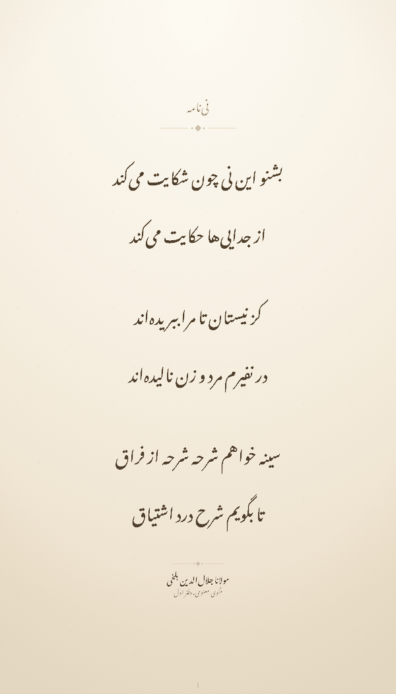
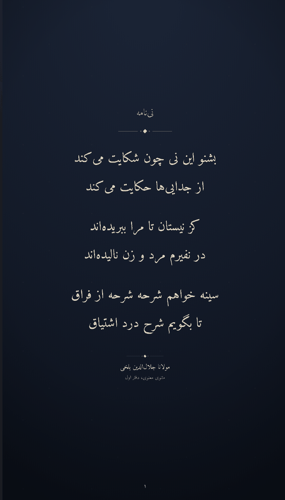
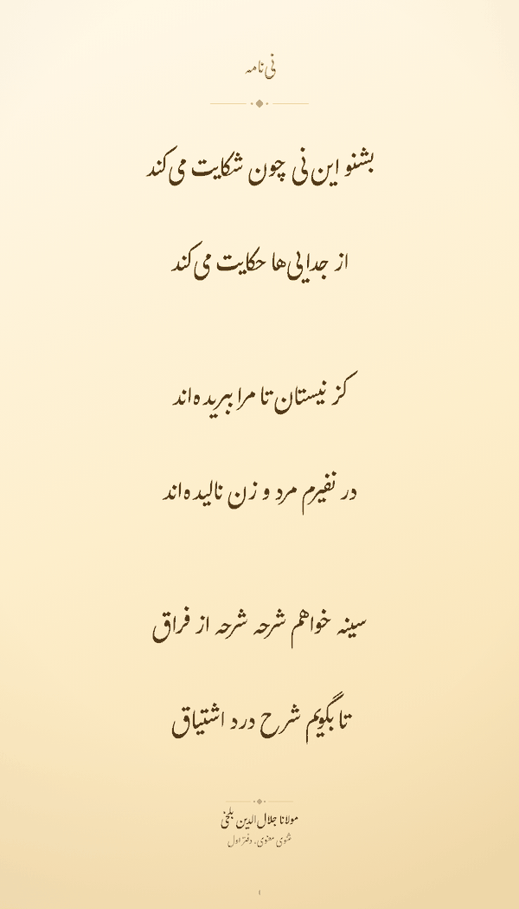

<div align="center">

# دفتر · Daftar

**صفحه‌ساز شعر پارسی که کاملاً داخل مرورگر شما اجرا می‌شود.**

[**▶ باز کردن برنامه**](https://parsabordbar.github.io/Daftar/) · [گزارش اشکال](https://github.com/ParsaBordbar/Daftar/issues) · [English](README.md)

[](https://github.com/ParsaBordbar/Daftar/actions/workflows/deploy.yml)
[](LICENSE)
[](https://react.dev)
[](https://www.typescriptlang.org)
[](https://vite.dev)
[](https://tailwindcss.com)

[](https://ganjoor.net)

<p>
  
  
  
</p>

<sub>نی‌نامه‌ی مولانا، در اندازه‌ی استوری — کاغذ کهنه / نستعلیق · شب / نسخ · زعفران / گلزار</sub>

</div>

---

## دفتر چیست؟

شعر پارسی موردنظرتان را بنویسید یا وارد کنید — یا مستقیماً از گنجینه‌ی [گنجور](https://ganjoor.net) بیرون بکشید —
سپس یک قلم و یک طرح کاغذ انتخاب کنید و صفحه‌ی آماده را به‌صورت تصویر PNG با کیفیت بالا، در اندازه‌ی دقیقِ همان‌جایی
که می‌خواهید منتشرش کنید، خروجی بگیرید.

نه سروری در کار است، نه حسابی لازم دارید، و نه هیچ مرحله‌ی میانی بین شما و تصویر نهایی وجود دارد. کل برنامه یک
بسته‌ی ایستا روی GitHub Pages است.

> **همین حالا امتحان کنید ← <https://parsabordbar.github.io/Daftar/>**

## قابلیت‌ها

### تقریباً تمام گنجینه‌ی شعر پارسی، همین‌جا

می‌توانید میان حدود ۲۳۴ شاعر و نزدیک به ۱۳۲٬۰۰۰ شعرِ گنجور بگردید، یکی را انتخاب کنید، فقط بیت‌هایی را که
می‌خواهید نگه دارید، و آن را همراه با عنوان، نام شاعر و منبع روی صفحه بیاورید. اندازه‌ی متن خودش را با آنچه
انتخاب کرده‌اید تطبیق می‌دهد.

اگر فقط بخشی از یک مصرع را به یاد دارید، جست‌وجوی تمام‌متن شعرهای دربردارنده‌ی آن را پیدا می‌کند — چه محدود به
شاعری که در حال مرورش هستید و چه در سراسر گنجور — و بخش منطبق را در نتیجه پررنگ نشان می‌دهد.

### ۱۸ قلم پارسی

در چهار گروه: نستعلیق، نسخ، بی‌سریف و تزئینی. همه‌ی قلم‌ها رایگان و دارای مجوز آزادند و پیش از افزوده شدن، وجود
حروف پارسی پ چ ژ گ ک ی در آن‌ها بررسی شده است. قلم‌ها فقط هنگام نیاز بارگذاری می‌شوند، پس هر بازدید یک قلم دانلود
می‌کند، نه هجده تا.

### ۸ طرح کاغذ

`کاغذ` کهنه · `شب` · `لاجورد` · `فیروزه` · `زعفران` · `سپید` · `انار` · `زغال` — هرکدام با رنگ مرکب، رنگ تأکید و
رنگ تذهیب مخصوص خودش.

### چینش و تزئین

سه مدل چینش: یک مصرع در هر خط، دو مصرع کنار هم برای بیتِ کلاسیک، و چینش آزاد برای شعر نو.
تزئینات الهام‌گرفته از نسخه‌های خطی: جداکننده، قاب دوتایی، نقش‌های گوشه‌ای، و شمسه.

### ۱۳ اندازه‌ی خروجی، با کیفیت ۱× / ۲× / ۳×

| اندازه | پیکسل در ۱× | اندازه | پیکسل در ۱× |
| --- | --- | --- | --- |
| استوری اینستاگرام | ۱۰۸۰ × ۱۹۲۰ | تلگرام | ۱۲۸۰ × ۱۶۰۰ |
| پست مربع اینستاگرام | ۱۰۸۰ × ۱۰۸۰ | چاپی A4 | ۱۲۴۰ × ۱۷۵۴ |
| پست عمودی اینستاگرام | ۱۰۸۰ × ۱۳۵۰ | چاپی A5 | ۸۷۴ × ۱۲۴۰ |
| پینترست | ۱۰۰۰ × ۱۵۰۰ | پس‌زمینه‌ی موبایل | ۱۴۴۰ × ۳۱۲۰ |
| پینترست بلند | ۱۰۰۰ × ۲۱۰۰ | پس‌زمینه‌ی دسکتاپ | ۲۵۶۰ × ۱۴۴۰ |
| لینکدین | ۱۲۰۰ × ۶۲۸ | | |
| لینکدین مربع | ۱۲۰۰ × ۱۲۰۰ | | |
| ایکس / توییتر | ۱۶۰۰ × ۹۰۰ | | |

اندازه‌های A4 و A5 در حالت ۱× معادل ۱۵۰ DPI هستند؛ برای فایل چاپی واقعیِ **۳۰۰ DPI آن‌ها را با کیفیت ۲×**
خروجی بگیرید (۲۴۸۰ × ۳۵۰۸ و ۱۷۴۸ × ۲۴۸۰).

### لینک اشتراک‌گذاری که کل صفحه را با خود می‌برد

تمام وضعیت صفحه فشرده و داخل بخش fragment آدرس قرار می‌گیرد. هیچ‌چیز جایی ذخیره نمی‌شود — هرکس لینک را باز کند
دقیقاً همان صفحه‌ی شما را می‌بیند و می‌تواند ویرایشش کند.

## حریم خصوصی: چه چیزی از مرورگر شما خارج می‌شود؟

| مورد | از دستگاه شما خارج می‌شود؟ |
| --- | --- |
| متن شعر، عنوان، چینش و تصویر PNG خروجی | **نه.** همه‌چیز محلی پردازش و کدگذاری می‌شود؛ خروجی هرگز آپلود نمی‌شود. |
| لینک اشتراک‌گذاری | **نه.** وضعیت در fragment آدرس است و مرورگرها fragment را به سرور نمی‌فرستند. |
| مرور و خواندن شعرهای گنجور | بله — خواندن مستقیم فایل‌ها از نسخه‌ی `ganjoor-data` روی jsDelivr. |
| جست‌وجوی تمام‌متن گنجور | بله — عبارت جست‌وجو به API عمومی گنجور (`api.ganjoor.net`) فرستاده می‌شود. |
| شمارنده‌ی صفحات | فقط یک افزایش ساده به یک سرویس شمارنده‌ی عمومی. بدون محتوا و بدون شناسه. |

## اجرای محلی

```bash
git clone https://github.com/ParsaBordbar/Daftar.git
cd Daftar
npm install
npm run dev
```

| دستور | کار |
| --- | --- |
| `npm run dev` | سرور توسعه‌ی Vite با HMR |
| `npm run build` | بررسی نوع‌ها (`tsc -b`) و سپس ساخت در `dist/` |
| `npm run preview` | اجرای محلی نسخه‌ی production |
| `npm run lint` | [oxlint](https://oxc.rs) |
| `npm run deploy` | ساخت و انتشار `dist/` روی `gh-pages` از روی سیستم خودتان |

## انتشار

هر push روی `main` فایل [`.github/workflows/deploy.yml`](.github/workflows/deploy.yml) را اجرا می‌کند: با
`VITE_BASE=/<repo-name>/` می‌سازد، `index.html` را به `404.html` کپی می‌کند تا لینک‌های عمیق کار کنند، و روی
Pages منتشر می‌کند. فقط یک‌بار باید از مسیر **Settings → Pages → Source: GitHub Actions** فعالش کنید.

اگر می‌خواهید از روی سیستم خودتان منتشر کنید، حتماً `VITE_BASE` را صریح بدهید — مقدار پیش‌فرض در
`vite.config.ts` با حرف کوچک `/daftar/` است و مسیرهای GitHub Pages به بزرگی و کوچکی حروف حساس‌اند:

```bash
VITE_BASE=/Daftar/ npm run deploy
```

## نحوه‌ی کار

### شعرها از کجا می‌آیند؟

مخزن [`ganjoor/ganjoor-data`](https://github.com/ganjoor/ganjoor-data) مجموعه‌ی گنجور را به‌صورت JSON ساده روی
jsDelivr و با CORS باز منتشر می‌کند، پس برنامه مستقیماً از CDN می‌خواند و همچنان بک‌اندی ندارد.

فایل `src/lib/ganjoor.ts` سه نوع فایل می‌گیرد — `manifest.json` برای فهرست شاعران، `_cat.json` برای کتاب یا فصل،
و یک فایل برای هر شعر — و هرکدام را در حافظه و `sessionStorage` نگه می‌دارد. گنجور هر بیت را دو مصرع با
`CoupletIndex` مشترک ذخیره می‌کند که با `Right` (مصرع اول) و `Left` برچسب خورده‌اند؛ تابع `toCouplets` این ساختار
را به مدل بندهای صفحه نگاشت می‌کند و مصرع‌های توضیحیِ `Comment` را کنار می‌گذارد.

به‌صورت پیش‌فرض نسخه‌ی `@main` دنبال می‌شود. برای قفل کردن روی یک نسخه‌ی ثابت، `VITE_GANJOOR_REF=<commit-sha>` را
تنظیم کنید.

> مخزن `ganjoor-data` هیچ مجوزی اعلام نکرده است. خودِ شعرها کلاسیک‌اند و مدت‌هاست از حق‌تکثیر خارج شده‌اند، و این
> برنامه داده را در زمان اجرا می‌خواند نه اینکه بازنشرش کند — اما اگر قصد دارید نسخه‌ای از آن را داخل مخزن خودتان
> کپی کنید، اول با نگهدارندگان گنجور تعیین تکلیف کنید.

### چرا خروجی دقیقاً شبیه پیش‌نمایش است؟

`html-to-image` فقط قلم‌هایی را می‌تواند درون‌ریزی کند که بتواند بخواندشان، و توانایی خواندن قواعد یک استایل‌شیت
cross-origin را ندارد. برای همین هر قلم — چه بسته‌شده در مخزن و چه از گوگل — دریافت، به base64 تبدیل، و در زمان
اجرا به‌صورت `@font-face` با data-URL تزریق می‌شود (`src/lib/fonts.ts`). همان CSS به‌عنوان `fontEmbedCSS` به
`html-to-image` داده می‌شود که هم تضمین می‌کند PNG با پیش‌نمایش یکی باشد و هم از پیمایش تکراری استایل‌شیت در هر
خروجی جلوگیری می‌کند.

ضمناً صفحه همیشه با اندازه‌ی منطقی واقعی‌اش (۱۰۸۰ × ۱۹۲۰ و مانند آن) در DOM حاضر است و فقط برای پیش‌نمایش با یک
transform در CSS کوچک می‌شود — پس خروجی یک ثبت دقیقِ پیکسل‌به‌پیکسل است، نه رندر دوباره در اندازه‌ای دیگر.

### پیکربندی

| چه چیزی | کجا |
| --- | --- |
| نام محصول، نشانی، واترمارک، متن‌های فارسی | `src/lib/brand.ts` |
| فهرست قلم‌ها | `src/lib/fonts.ts` |
| طرح‌های کاغذ | `src/lib/themes.ts` |
| اندازه‌های خروجی | `src/lib/formats.ts` |
| نشانی شمارنده | `src/lib/counter.ts` یا `VITE_COUNTER_NS` / `VITE_COUNTER_KEY` |
| نسخه‌ی داده‌ی گنجور | `VITE_GANJOOR_REF` (پیش‌فرض `main`) |
| مسیر پایه‌ی Pages | `VITE_BASE` (پیش‌فرض `/daftar/`) |

شمارنده به‌صورت پیش‌فرض از یک سرویس عمومی رایگان استفاده می‌کند. اگر در دسترس نباشد، مسدود یا محدود شده باشد،
برنامه به شمارش محلی برمی‌گردد و بدون مشکل به کارش ادامه می‌دهد — پس عوض کردنش تغییری یک‌فایله و بدون عارضه است.

## مجوز قلم‌ها

هر ۱۸ قلم قابل انتخاب رایگان و دارای مجوز آزادند. شانزده تای آن‌ها SIL OFL 1.1 هستند و در زمان اجرا از
Google Fonts گرفته می‌شوند، پس این مخزن آن‌ها را بازنشر نمی‌کند.

دو قلم داخل [`public/fonts/`](public/fonts/README.md) قرار دارند: **میخک** (SIL OFL 1.1) و **تنها** (مجوز
Bitstream Vera، با تغییرات نویسنده در مالکیت عمومی). هر دو مجوز لازم می‌دانند که متن مجوز همراه قلم منتشر شود،
بنابراین `Mikhak-OFL.txt` و `Tanha-LICENSE.txt` باید در همان پوشه بمانند.

ده خانواده‌ی قلم که پیش‌تر در مخزن بودند حذف شدند، چون بدون اعطای مجوز ادعای حق‌تکثیر کرده بودند یا تمام حقوق را
برای خود محفوظ دانسته بودند — فهرست و دلیلشان در بخش «Removed» فایل `public/fonts/README.md` آمده است. فهرست
انتخاب قلم از آرایه‌ی `FONTS` در `src/lib/fonts.ts` ساخته می‌شود، پس افزودن یا حذف یک قلم تغییری یک‌فایله است.

## مجوز

کد این پروژه [MIT](LICENSE) است. استفاده کنید، fork کنید، تغییر دهید، حتی تجاری منتشرش کنید — بدون نیاز به اجازه
و بدون هزینه. تنها شرط MIT این است که خط حق‌تکثیر و متن مجوز همراه کد بماند.

فراتر از آن، یک اشاره‌ی ساده کافی است. مثلاً «بر پایه‌ی [دفتر](https://github.com/ParsaBordbar/Daftar)» در README،
صفحه‌ی درباره یا فوتر پروژه‌تان دقیقاً همان چیزی است که این پروژه امیدوارش است. این یک درخواست است، نه یک الزام.

مجوز MIT کد و محتوای خودِ این مخزن را پوشش می‌دهد و چیزهایی را که با شرایط خودشان می‌آیند دوباره مجوزدهی نمی‌کند:

- **قلم‌های بسته‌شده در مخزن** — میخک (SIL OFL 1.1) و تنها (مجوز Bitstream Vera). فایل‌های
  `public/fonts/Mikhak-OFL.txt` و `public/fonts/Tanha-LICENSE.txt` را در هر fork یا build نگه دارید. ببینید:
  [`public/fonts/README.md`](public/fonts/README.md).
- **قلم‌های میزبانی‌شده روی گوگل** — SIL OFL 1.1، در زمان اجرا دریافت می‌شوند و هرگز از اینجا بازنشر نمی‌شوند.
- **شعرها** — مجموعه‌ی گنجور که در زمان اجرا از CDN خوانده می‌شود. متن‌ها کلاسیک و خارج از حق‌تکثیرند، اما خودِ
  `ganjoor-data` هیچ مجوزی اعلام نکرده؛ بخش «شعرها از کجا می‌آیند؟» را ببینید.

---

<div align="center">

ساخته‌ی [پارسا بردبار](https://github.com/ParsaBordbar) · شعرها از [گنجور](https://ganjoor.net)

</div>
